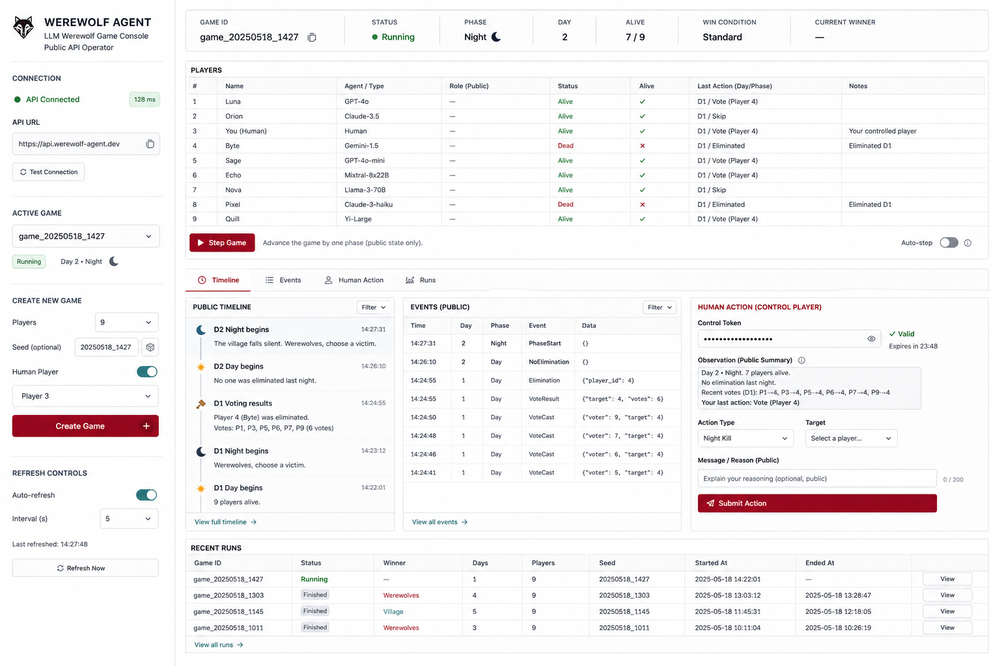
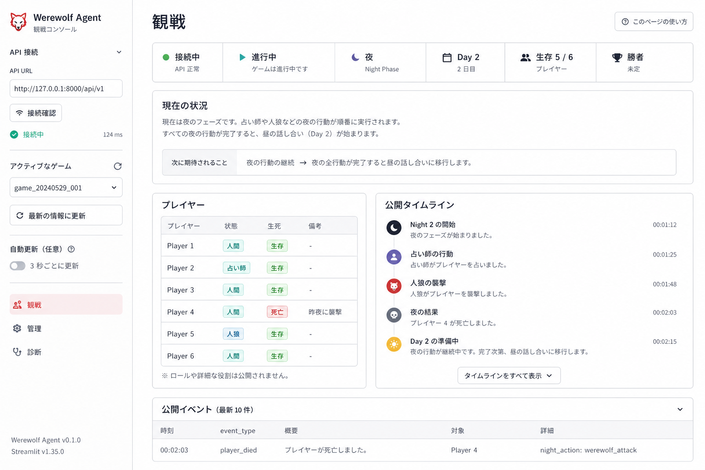
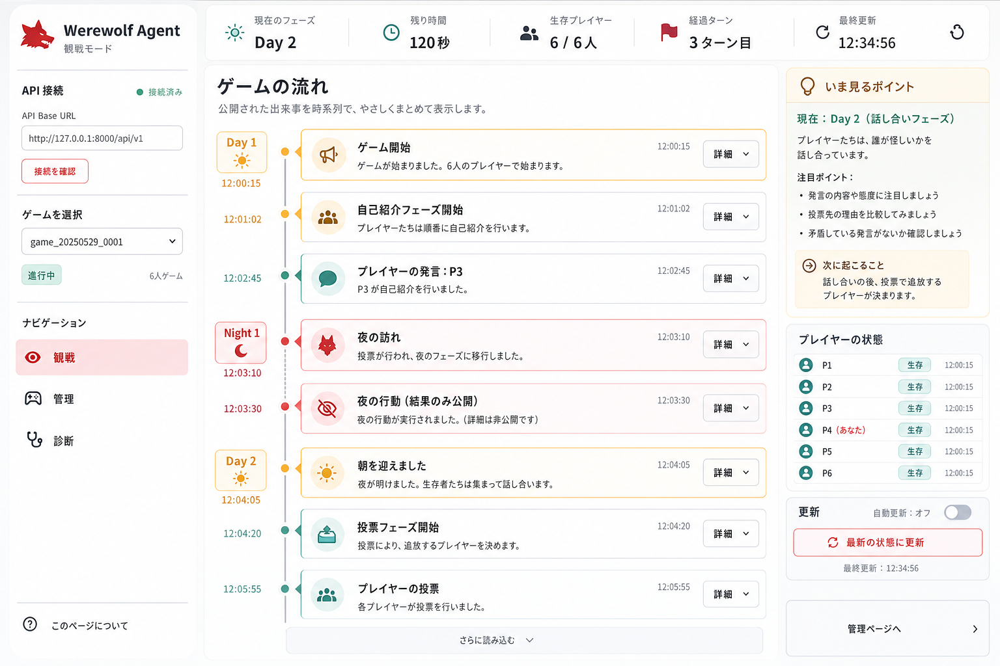
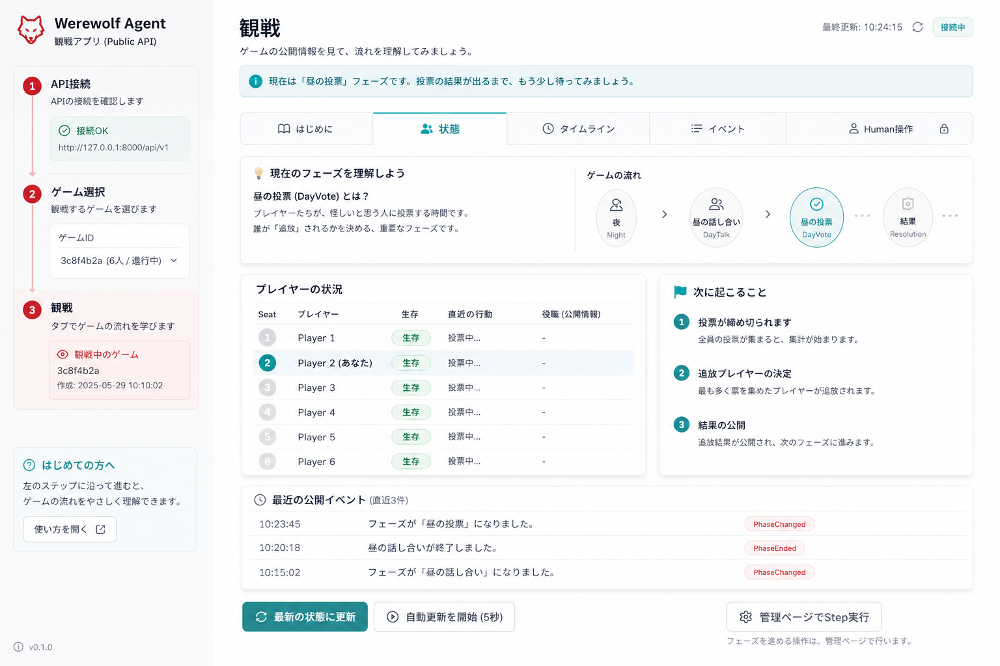
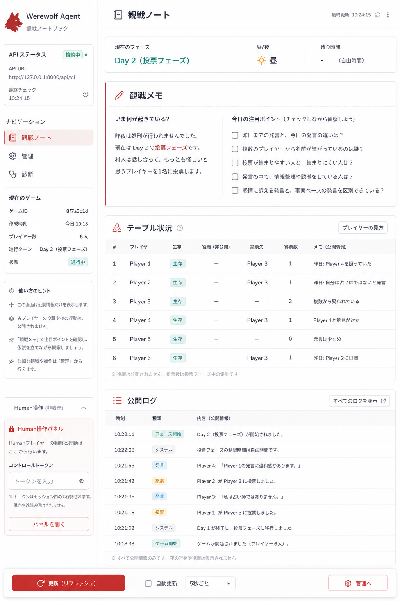
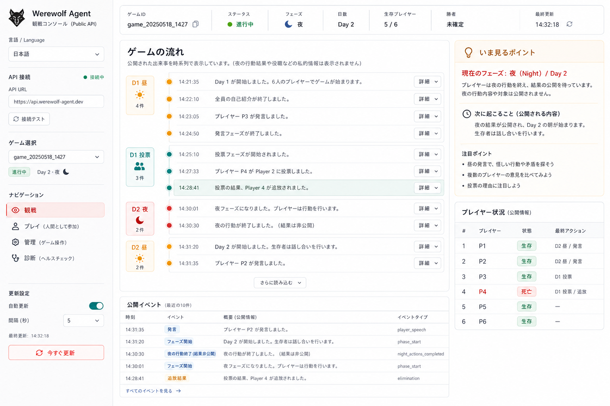
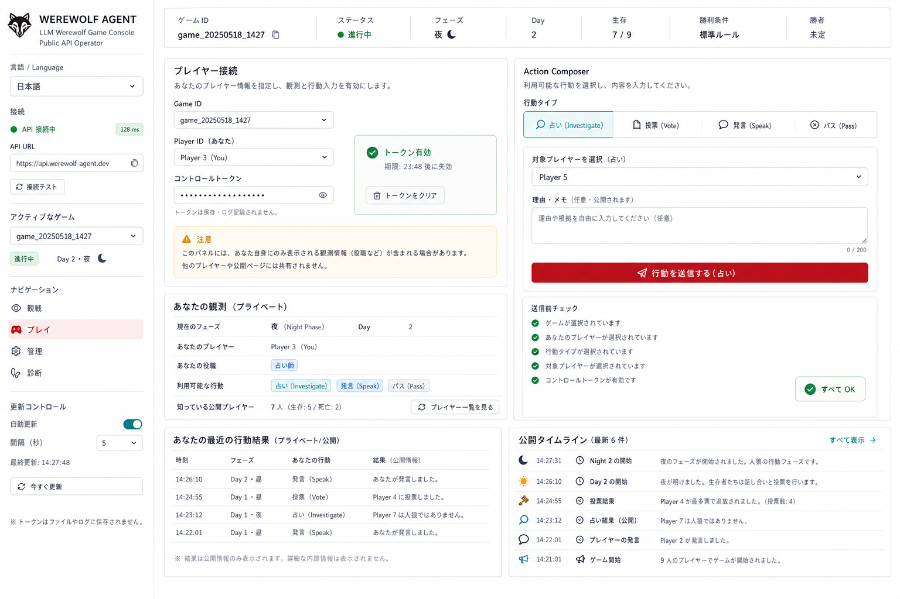

# Streamlit UI Design History

このメモは Streamlit UI の検討履歴です。
最終実装では初期の 1 画面コンソール案を採用し、多言語対応だけを追加します。

## 最終採用

### 00 Initial Console

- 採用理由: 作成、観戦、Step 実行、Timeline、Events、Human Action、Runs を 1 画面で扱える。
- 実装方針: Streamlit 標準 component と最小 CSS で、表と tab を中心に構成する。
- 追加条件: UI 文言は日本語 default とし、English へ切替可能にする。

## 検討した案

### 01 Guided Observer

- 狙い: 初心者向けに観戦導線を整理する。
- 不採用理由: 1 画面で操作まで完結する初期案より、操作効率が落ちる。

### 02 Story Timeline

- 狙い: public event を物語として読みやすくする。
- 不採用理由: 観戦体験は良いが、作成、Step、Human Action、Runs を同時に扱う今回の v1 には分割が多い。

### 03 Learning Tabs

- 狙い: 初回利用者が状態、Timeline、Events を順に理解できるようにする。
- 不採用理由: 学習導線が主になり、運用コンソールとしての一覧性が弱い。

### 04 Operator Notebook

- 狙い: 観戦メモと public log を notebook 風に整理する。
- 不採用理由: v1 ではメモよりも API 操作と状態確認の共存を優先する。

### 05 Final Story Observer

- 狙い: Story Timeline を最終案として再整理する。
- 不採用理由: 後続判断で初期コンソール案へ戻したため、今回は採用しない。

### 06 Final Player Panel

- 狙い: Human player 用の専用入力装置を設計する。
- 不採用理由: 今回は初期コンソール案へ戻し、Human Action は同一画面内の tab として扱う。

## 現在の実装スコープ

- Sidebar: API URL、接続状態、active game、game 作成、refresh、auto-refresh、言語切替
- Main: status strip、players table、Step Game
- Tabs: Timeline、Events、Human Action、Runs
- i18n: `ja` default、`en` 同梱
- Backend access: すべて FastAPI public API 経由
