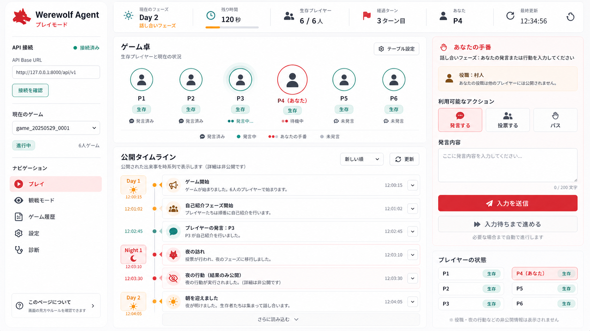
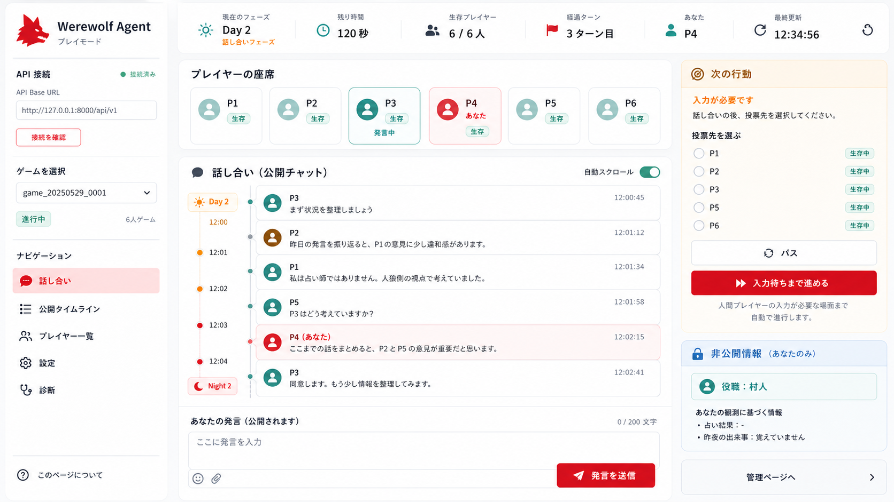
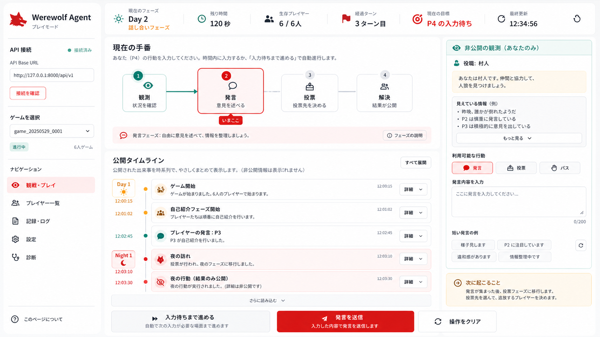
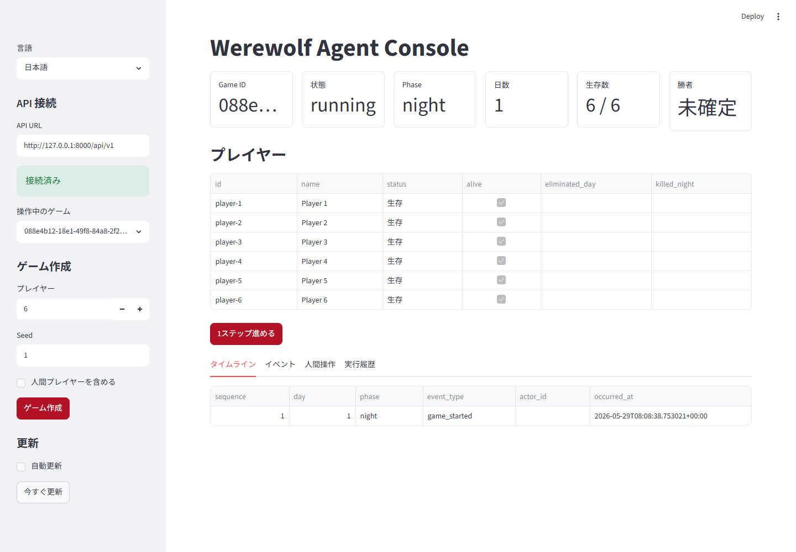
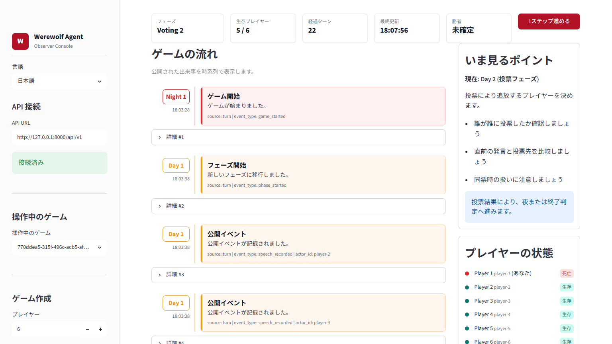
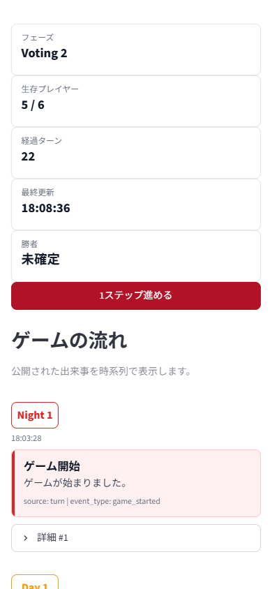

# Streamlit UI

Streamlit 画面の検討メモです。実装の正は「月明かりの卓」を基準にした Play / Observe 共通画面です。
右側にプレイヤー状態を再掲せず、中央の `ゲーム卓` に集約します。右側は Play では `あなたの手番`、
Observe では `観戦ログ` を主役にします。

この画面では後方互換を維持しません。旧 UI、旧保存形式、旧 session state、旧入力導線へ
合わせる処理は作らず、現在の UX と保守性を優先します。

## 目的

- 一般ユーザーが Streamlit だけで 1 game を開始し、1 manual player として決着まで遊べる
- 画面は `GameClient` portだけを使い、Supabase Authで取得したaccess tokenを添えて
  FastAPIへ接続する。ゲームデータのData API、RPC、Realtimeは利用しない
- 文言はゲームらしさと分かりやすさのバランスを取り、メタ表現を画面本文に出さない
- 設定値、表示モデル、API 操作、HTML 部品を分け、画面変更が内側の層へ波及しないようにする

## 採用案

A案を実装の基準にします。中央の `ゲーム卓` にプレイヤー状態を集約し、右側は `あなたの手番` と
行動入力に集中させます。プレイヤー一覧と生存状態は右側に再掲しません。

画面構成:

- メイン初期画面: `ゲーム開始設定`。初回表示と sidebar の `プレイ` は常に開始設定へ戻す
- 左サイドバー: 状態の一言表示、`履歴`、`プレイ`、`観戦`、`設定`
- `履歴`: HTTP APIが返す閲覧可能なgame summaryを選び、内部IDや操作用キーは画面に出さない
- `ゲーム開始設定` / `観戦開始設定`: シナリオ、設定プリセット、ナレーション、seed、役職人数、キャラクター割当、local rules を編集する。全体人数の直接入力は置かず、役職人数から導出する
- `プレイ`: 操作席を選ぶ。`観戦` は操作席を持たず、公開状態と公開タイムラインだけを表示する
- `設定`: 言語、データソース状態、役職定義、キャラクター定義、追加定義のクリアだけを扱う。game 固有の設定は置かない
- 上部ステータス: フェーズ、日数、生存人数、経過ターン、現在の手番、状態、勝敗
- 中央: `ゲーム卓`
- 右側: Play では `あなたの手番`、`あなたの役職`、`見えている情報`、`できる行動`
- 右側: Observe では操作 UI を出さず、公開タイムラインの直近イベントを `観戦ログ` にまとめる
- 中央下: `公開タイムライン`。completed 時は末尾に `結果サマリー` と次の選択を表示する

mobile では `ゲーム卓`、右ペイン相当、`公開タイムライン` の順で縦積みします。

## 比較案

## QA 画像

一時キャッシュと採用前の QA screenshot は `%TEMP%\werewolf-agent` 配下へ置きます。画面検討・QA の採用画像は docs 配下へ置きます。

- 
- 
- 
- 

## 実装メモ

- 装飾画像、絵文字、gradient、外部fontを使わず、明るいアイボリー、藍、深緑、琥珀、鈍い赤を状態へ限定して使う
- UI 文言とイベント種別、行動、フェーズ、役職の表示名は `clients/streamlit/resources/i18n.toml` に閉じる
- `WEREWOLF_STREAMLIT_I18N_FILE` を指定すると外部 TOML で UI 文言を差し替えられる
- CSS は `tokens`、`base`、`layout`、`components`、`streamlit`、`responsive` の固定順で読み、外部overrideを持たない
- native widgetのthemeはrepository管理の`.streamlit/config.toml`を正とし、localとDockerで同じ設定を使う
- 画面要素の表示有無、順序、配置、列数は各viewが所有し、public / private判定、action availability、API payload、game state計算はview modelとAPI responseを正とする
- 画面起動時の初期言語とデータソース状態は `AppSettings` から読み、実行中の選択は `StreamlitPreferences` として Streamlit session state に保持する
- `streamlit/icons.py` は icon metadata だけを持ち、label は i18n catalog から取得する
- 後からログアイコンや専用画像に置き換える場合も、画面本体ではなくマップを差し替える
- 各viewは製品仕様の構造を明示し、動的renderer registryを持たない
- game 操作は `streamlit/operations.py` から `GameClient` protocol を直接使う
- game 固有の開始設定は `GameSetupDraft` として `streamlit/setup.py` に閉じる
- 発言・投票送信後は active client の `advance_game` を 1 回だけ呼び、次の手番へ進める
- `入力待ちまで進める` は Streamlit session state と `st.fragment` で 1 step ずつ進め、`一時停止` で次 step 前に止める
- 右ペインは `right_command_panel` container を操作盤の外枠とし、手番状態、秘匿観測、操作、観測メモを固定順に並べる
- domain / usecase の `available_actions` を正とし、画面側だけで多重発言や多重投票を隠す実装にはしない
- HTML 断片とescapeはstatus ribbon、game tableau、公開timelineだけを`streamlit/components.py`に閉じる
- `view_models.py` は表示用データ変換だけを担当し、Streamlit、domain、usecase、`api` に依存させない
- `公開タイムライン` には `/timeline` の `GameTimelineItem` だけを使う
- 右ペイン最下部の `観測メモ（公開情報）` は public state と public timeline だけから作り、private observation や reveal は混ぜない
- 発言内容、投票、投票結果、夜明けの犠牲者有無は表示し、夜行動の対象、護衛先、占い結果、role は表示しない
- Observe は public state と public timeline だけを使い、private observation、admin reveal、
  LLM trace へ到達しない
- 操作用キーは Streamlit session state のみに保持し、保存スロット、画面、ログには出さない
- history selection は現在 version だけを読み、旧 save fallback は持たない

## ブラウザ QA

Browser plugin は直接 tool として見えない場合でも、`node_repl` から初期化できます。
desktop / mobile の再検証手順は [streamlit-browser-qa.md](streamlit-browser-qa.md) に残します。
